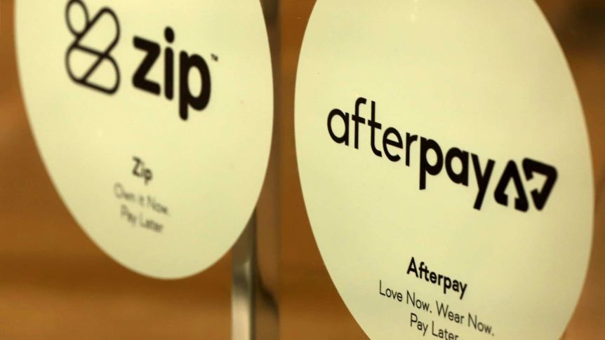

# Afterpay Case Study

##### An Afterpay page found on the website of partner retailer LBLA

## The rise of an Australian alternative financing company and the future of consumer spending

### What is Afterpay?

Afterpay was founded in 2014 and formally incorporated in 2015 by two Australian entrepreneurs, Nick Molnar and Anthony Eisen. Molnar was originally inspired to form Afterpay while he was a student in college in response to the 2008 Global Financial Crisis, which he claims changed customer behavior patterns towards, "a huge swing among Millennials toward spending money on debit cards, not credit cards." Afterpay was originally listed on the Australian Securities Exchange (ASX) in 2016 at the price of $1 USD per share, raising approximately $25 million USD in their original IPO listing. 

### From Starup to Regional Giant

Afterpay was created after the recession of 2008, which Molnar believes scared many younger consumers into being more responsible with their finances and avoid the pitfalls that brought on the global recession.“Millennials are tech savvy, informed and conscious about not falling into debt. Trust is really important to them... They’re into budgeting and being responsible with their spending, but they also still want that instant gratification in retail.” It appears that services such as Afterpay are becoming an increasingly more attractive alternative to traditional credit cards, with Australia alone seeing almost 400,000 credit card accounts closing between March and June of 2020 as a result of the ongoing Coronavirus pandemic. 

Unlike traditional layaway programs, in which a store will hold a customer's items until the consumer has finished paying for it, Afterpay allows customers to purchase and receive their products right away and finish paying it off in four equal instalments. A lack of interest in payments, replaced with a late fee if the consumer misses a payment, has also driven the growing demand for services such as Afterpay. 

The growth of Afterpay would not be possible, however, if not for their merger with Touchcorp (technology provider) in 2017. "The Afterpay and Touchcorp merger represents a significant milestone and will enable Afterpay to be fully integrated from a technology perspective and boost the growth and earnings potential of the combined business," according to co-founder and Executive Chairman Anthony Eisen. The use of Amazon infrastructure such as Redshift and Aurora allows Afterpay to manage their database and inventory very efficiently. It appears that the majority of their coding takes place using Java, evidenced by their use of React, Kotlin and AngularJS. Slack and Zendesk are also used for internal and customer communication, respectively, with GitHub, Docker and AWS Fargate being used for DevOps. 

## Growth of Alternate Finance and Rise of Oceania's FinTech Industry

##### Afterpay and Zip have become mainstrays in Australian retailers

Afterpay is one of many rising companies within the alternative financing industry, an industry which as a whole has become increasingly popular due to the growing use of the internet as well as the financial hardships brought about by the Coronavirus pandemic. Over the past decade, multiple similar services sprung up including Affirm, Zip, and Laybuy among many others. 

The latter two companies, Zip and Laybuy, have also come out of Australia or the Oceania region, a sign of the growing FinTech presence from the Oceania region. Afterpay and Zip had a combined 5.4 million customers in Australia alone, while Laybuy expanded into Australia after establishing themselves with 500,000 users in New Zealand. 

Meanwhile, the US based Affirm offers a similar product and has partnered with retail powerhouse Walmart to provide alternative financing for the established giant both in-store and online.

## Results

While Afterpay and the aforementioned companies appear to be a driving force in the diminishing use of credit cards, Afterpay's ability to increase online traffic to virtual retailers and increase the spending patterns of consumers is the main success the company has achieved. 

When comparing just the holiday seasons of 2019 and 2020, Afterpay saw basket sizes increase by 30% and referrals to virtual retailers from their site increased by 145%. The total referrals appeared to have reached 1.2 million in the United States and 1.9 million global. This growth came in spite of the global economic downturn as a result of the COVID-19 pandemic. Likewise, Afterpay has established a physical card to be used for in-store purchases, which came into the market in the Fall of 2020. As of January 4th, over 2 million Afterpay users had registered to use an Afterpay card.

Additionally, stock trading has boded well for Afterpay. The price of Afterpay stock in the ASX is currently trading at $143 AUD, a massive increase from the low price point of $8.90 AUD seen in March of 2020. This huge increase in price occurred during the worst of the pandemic, a clear indication of investor confidence in the midst of an economic downturn. 

Afterpay's growth is not hampered by the concurrent growth of domestic competitors Zip and Laypay. Afterpay and Zip have become mainstays in the Australian market, to the point that the word "Afterpay" has become a verb similar to how "Google" or "Xerox." Laypay is currently attempting to enter the Australian market, but has an established customer base in New Zealand. Meanwhile, Affirm in the United States recently launched an IPO in which their shares were sold for $49 USD per share, raising $1.2 billion USD. Affirm's partnership with Walmart also gives the former a huge advantage over Afterpay, and may be a barrier for further expansion into the American market.  

## Recommendations

There are limits to Afterpay, however, which could limit their expansion unless they were addressed. For example, Afterpay is only available through partnered retailers. This obviously excludes non-partner businesses, though this may not be the retailer's fault. Many small local businesses may not have the infrastructure to support Afterpay's model. Although it would run contrary to Afterpay's mission, the inclusion of a traditional credit platform would help to reach non-participating retailers. Afterpay has created a physical card for their services and are available on Apple and Google Pay, which demonstrates the company's ability to run a traditional line of credit. This credit line would not have to interfere or interact with their non-traditional counterpart but would likely be able to run on existing infrastructure available to Afterpay. 

Afterpay has multiple options when it comes to integrating a traditional credit line, including using Paypal infrastructure or turning to a traditional institution like banks in order to extend a line of credit to consumers. This blend of FinTech and traditional financial services provide a successful bridge between the past and future of finance, a feat that would allow Afterpay to reach consumers who may not be up to speed with today's technology or are unwilling to adopt this new service.

#
## Sources:
### Information

Afterpay: Afterpay.com

Techcrunch: https://techcrunch.com/2019/02/27/affirms-latest-partnership-brings-its-alternative-financing-to-walmarts-u-s-stores-and-website/

Business Insider AU: https://www.businessinsider.com.au/laybuy-has-already-beaten-afterpay-in-new-zealand-now-its-launching-in-australia-and-bringing-half-a-million-kiwis-with-it-2019-9

FN Arena: https://www.fnarena.com/index.php/2018/01/30/afterpays-us-foray-carries-high-expectations/

Business News Australia: https://www.businessnewsaustralia.com/articles/afterpay-and-touchcorp-merger-is-now-complete.html

ABC News (Australia): https://www.abc.net.au/news/2020-08-17/credit-cards-ditched-millenials-buy-now-pay-later-coronavirus/12534560

Nabtrade AU: https://www.nabtrade.com.au/investor/insights/latest-news/news/2020/08/the_rise_of_afterpay#:~:text=Afterpay%20commenced%20operations%20in%20early,on%20through%20thick%20and%20thin.

PR Newswire: https://www.prnewswire.com/news-releases/afterpay-basket-size-increased-30-during-holiday-2020-301200037.html

News.com.au: https://www.news.com.au/finance/money/costs/how-a-recession-gave-one-aussie-guy-a-billiondollar-business-idea/news-story/47ea033152bfbdc85ccc4340e05580fe

Stackshare: https://stackshare.io/afterpay/afterpay

Google Finance: https://www.google.com/finance/quote/APT:ASX?sa=X&ved=2ahUKEwjJoMrZtrjuAhWSZM0KHf84BkgQ3ecFMAB6BAgNEBk

Reuters: https://www.reuters.com/article/us-affirm-holdings-ipo-idINKBN29I00E

### Images

Lash Box LA: https://www.lashboxla.com/pages/afterpay

ABC News (Australia): https://www.abc.net.au/news/2020-08-17/credit-cards-ditched-millenials-buy-now-pay-later-coronavirus/12534560

Yahoo Finance Australia: https://au.finance.yahoo.com/news/afterpay-vs-credit-card-which-should-you-choose-201355445.html